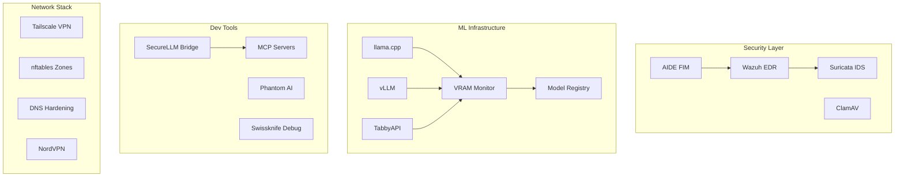

# NixOS Configuration

A modular, hardened NixOS configuration covering ML infrastructure, defense-in-depth security, custom package management, and automated CI/CD.

[](https://nixos.org)
[](https://github.com/VoidNxSEC/nixos/actions/workflows/ci.yml)
[](https://gitlab.com/VoidNxSEC/nixos)
[](https://app.cachix.org)
[](#security-notice)
[](LICENSE)

---

## Overview

This repository contains the declarative configuration for a production NixOS workstation. It is structured as a Nix flake with 278 modules across 20 categories. Notable features:

- **ML Infrastructure** — GPU orchestration with llama.cpp, vLLM, and TabbyAPI backends.
- **Defense-in-Depth Security** — Kernel hardening, AIDE, ClamAV, AppArmor, and a full SOC stack (Wazuh, OpenSearch, Suricata).
- **Custom Package System** — Sandboxed package builders with Firejail/Bubblewrap isolation and audit trails.
- **Developer Tooling** — SecureLLM Bridge, MCP servers, AI-assisted CLI utilities.
- **Observability** — Prometheus, Grafana, Vector, and structured logging across the stack.

---

## Architecture


```mermaid
graph TB
    subgraph "Security Layer"
        AIDE[AIDE FIM]
        ClamAV[ClamAV]
        Wazuh[Wazuh EDR]
        Suricata[Suricata IDS]
    end

    subgraph "ML Infrastructure"
        LlamaCPP[llama.cpp]
        vLLM[vLLM]
        TabbyAPI[TabbyAPI]
        VRAM[VRAM Monitor]
        Registry[Model Registry]
    end

    subgraph "Dev Tools"
        SecureLLM[SecureLLM Bridge]
        MCP[MCP Servers]
        Phantom[Phantom AI]
        Swissknife[Swissknife Debug]
    end

    subgraph "Network Stack"
        Tailscale[Tailscale VPN]
        Firewall[nftables Zones]
        DNS[DNS Hardening]
        NordVPN[NordVPN]
    end

    LlamaCPP --> VRAM
    vLLM --> VRAM
    TabbyAPI --> VRAM
    VRAM --> Registry
    SecureLLM --> MCP
    Wazuh --> Suricata
    AIDE --> Wazuh
```

### Module Distribution

| Category       | Modules | Notes                                     |
| -------------- | ------- | ----------------------------------------- |
| Security + SOC | 39      | AIDE, ClamAV, Wazuh, Suricata, hardening  |
| ML             | 36      | llama.cpp, vLLM, TabbyAPI, model registry |
| Packages       | 36      | Sandboxed package builders                |
| Shell          | 35      | Aliases, rebuild system, utilities        |
| Services       | 16      | GPU orchestration, MCP servers            |
| Network        | 12      | Tailscale, VPN, DNS, firewall zones       |
| Hardware       | 12      | Thermal forensics, NVIDIA tuning          |

**Totals**: 20 categories, 278 modules, ~48k lines of Nix.

---

## Key Subsystems

### ML Infrastructure

GPU-accelerated LLM stack integrated as NixOS modules:

```nix
kernelcore.ml.offload.enable = true;
```

- Backends: llama.cpp (turbo + swap variants), vLLM, TabbyAPI.
- SQLite model registry with auto-discovery.
- Rust-based REST control API on port 9000.
- Real-time VRAM monitoring with automatic offloading under pressure.
- MCP protocol integration for IDE clients.

### Security & SOC

Defense-in-depth with a complete SOC stack:

```nix
kernelcore.soc.enable = true;
kernelcore.security.hardening.enable = true;
```

- **File integrity & AV**: AIDE, ClamAV with scheduled scans.
- **Endpoint & network**: Wazuh EDR, Suricata IDS/IPS, AppArmor.
- **Hardening**: kernel sysctl/boot params, compiler hardening (PIE/RELRO/SSP), SSH hardening with key-only auth.
- **SIEM/Logs**: OpenSearch, Grafana, Vector, threat-intel feeds.

### Custom Package Management

Sandboxed package builders with audit logging:

- `.deb` packages under Firejail isolation.
- `tar.gz` extraction with FHS environments.
- npm packages with sandbox profiles.
- Automatic hash verification and GitHub release tracking.
- Examples: AppFlowy, Gemini CLI, Proton Suite, Cursor.

### Developer Tools

```nix
services.securellm-mcp.enable = true;
kernelcore.tools.enable = true;
kernelcore.swissknife.enable = true;
```

- **SecureLLM Bridge** — Multi-provider LLM orchestration (OpenAI, Anthropic, Bedrock, local) with rate limiting and fallback.
- **Tools CLI** — `nix-utils`, `secops`, `diagnostics`, `llm`, `mcp`.
- **Swissknife** — Thermal forensics, VRAM monitoring, emergency abort, build reproducibility analysis.

Dev shells:

```bash
nix develop .#python    # Python with ML libs
nix develop .#cuda      # CUDA toolchain
nix develop .#rust      # Rust toolchain
nix develop .#infra     # Infrastructure tools
```

### Network Security

- Tailscale mesh VPN (zero-config peer-to-peer).
- NordVPN with kill-switch and post-quantum encryption.
- nftables-based firewall zones.
- DNSCrypt + DNS-over-TLS with caching.
- NGINX reverse proxy for Tailscale-exposed services.

### Desktop

- **Hyprland** (Wayland): custom v0.52.2 overlay, Waybar, Wofi, Wlogout.
- **i3** (X11): Polybar, Rofi, Picom.

---

## Notable Implementations

**Thermal Forensics** (760 lines)

```bash
thermal-forensics --duration 180
laptop-verdict /var/lib/thermal-evidence
```

3-phase stress test collecting baseline/stress/rebuild thermal data for hardware warranty claims.

**Advanced Rebuild** (674 lines)

```bash
rebuild-advanced --profile workstation --check-thermal
```

Pre-flight checks, thermal monitoring, and binary cache integration during rebuilds.

**GPU Orchestration** (252 lines)
Unloads llama.cpp models when VRAM drops below 2GB; maintains service priority queues.

**SOC Stack**
Full Wazuh + OpenSearch + Suricata deployment running on a workstation-class machine.

---

## Repository Structure

```
/etc/nixos/
├── flake.nix                # Flake entry point
├── modules/                 # 278 modules / 20 categories
│   ├── ml/                  # ML infrastructure (36)
│   ├── security/            # Security + SOC (39)
│   ├── packages/            # Custom packages (36)
│   ├── shell/               # Shell configuration (35)
│   ├── services/            # System services (16)
│   ├── network/             # Networking (12)
│   ├── hardware/            # Hardware tuning (12)
│   └── ...                  # 13 more categories
├── hosts/kernelcore/        # Host configuration
├── overlays/                # Package overlays
├── lib/                     # Reusable functions
├── secrets/                 # SOPS-encrypted secrets
└── docs/                    # Documentation
```

---

## Quick Start

### Prerequisites

- NixOS 23.11+ or nixos-unstable
- NVIDIA GPU (optional, for ML features)
- Git

### Installation

```bash
git clone https://github.com/VoidNxSEC/nixos.git /etc/nixos
cd /etc/nixos

# Review host configuration
cat hosts/kernelcore/configuration.nix

# Dry-run build
sudo nixos-rebuild build --flake .#kernelcore

# Apply
sudo nixos-rebuild switch --flake .#kernelcore
```

### Feature Flags

```nix
{
  kernelcore.ml.offload.enable = true;          # ML infrastructure
  kernelcore.soc.enable = true;                 # SOC/SIEM stack
  kernelcore.security.hardening.enable = true;  # Kernel/compiler hardening
  services.securellm-mcp.enable = true;         # SecureLLM Bridge
  kernelcore.tools.enable = true;               # Unified CLI suite
  kernelcore.swissknife.enable = true;          # Debug toolkit
}
```

---

## CI/CD

CI runs on GitHub Actions (primary) with a GitLab CI mirror. The main `ci.yml` workflow runs `nix flake check` and builds the `kernelcore` closure on every push; additional workflows handle observability/debug (tmate), deployment, rollback, SOPS secret setup, and weekly `flake.lock` updates.

A Cachix binary cache (`marcosfpina`) is populated by CI so local rebuilds pull pre-built closures when available.

For the full workflow catalog, composite actions, required secrets, and reusable-workflow examples, see [.github/CI-CD.md](.github/CI-CD.md). The GitLab pipeline is defined in [`.gitlab-ci.yml`](./.gitlab-ci.yml).

---

## Documentation

- [Technical Overview](docs/TECHNICAL-OVERVIEW.md)
- [CI/CD Architecture](docs/CI-CD-ARCHITECTURE.md)
- [GitHub Actions reference](.github/CI-CD.md) — composite actions, workflow catalog, secrets
- [Workflow debugging guide](.github/workflows/WORKFLOWS.md) — tmate, observability, notifications

---

## Security Notice

- **Environment**: production workstation.
- **Posture**: hardened (kernel, compiler, network, filesystem).
- **Secrets**: encrypted with SOPS + age.
- **Audit**: AIDE + auditd + Wazuh logging across system surfaces.

Sensitive material (API keys, SSH keys, certificates) lives encrypted in `secrets/`. Decryption requires the appropriate age key.

---

## Stats

- **Modules**: 278 across 20 categories
- **Nix lines**: ~47,800
- **Security + SOC modules**: 39
- **ML modules**: 36
- **Custom packages**: 36
- **Shell modules**: 35

Largest modules:

1. `vmctl` — 959 lines (VM orchestration CLI)
2. `thermal-forensics` — 760 lines (hardware evidence collection)
3. `rebuild-advanced` — 674 lines (safe rebuild system)

---

## License

[MIT](LICENSE)

---

## Acknowledgments

Built on:

- [NixOS](https://nixos.org) — declarative Linux distribution
- [Hyprland](https://hyprland.org) — Wayland compositor
- [Wazuh](https://wazuh.com) — XDR/SIEM platform
- [llama.cpp](https://github.com/ggerganov/llama.cpp) — LLM inference engine

---

**Maintained by**: [@VoidNxSEC](https://github.com/VoidNxSEC)
**Hardware**: Lenovo ThinkPad + NVIDIA GPU
**Channel**: nixos-unstable
**Status**: production (daily driver)

# NIXOS SYSTEM CONFIGURATION

## LEGAL NOTICE AND DISCLAIMER

**PROPRIETARY SYSTEM CONFIGURATION**

This repository contains proprietary system configuration files for production infrastructure. Unauthorized access, use, modification, or distribution of this configuration is strictly prohibited and may constitute a violation of applicable laws.

### TERMS OF USE

1. **Access Restrictions**: Access to this repository is restricted to authorized personnel only.

2. **Confidentiality**: All configuration files, scripts, and documentation contained herein are confidential and proprietary information.

3. **No Warranty**: This configuration is provided "AS IS" without warranty of any kind, either express or implied, including but not limited to the implied warranties of merchantability, fitness for a particular purpose, or non-infringement.

4. **Limitation of Liability**: In no event shall the authors or copyright holders be liable for any claim, damages, or other liability arising from the use of this configuration.

5. **Security Compliance**: This system implements security hardening measures. Any attempt to circumvent, disable, or compromise these security measures is prohibited.

6. **Data Protection**: This configuration handles sensitive data and cryptographic material. Unauthorized access or disclosure may result in legal action.

### SYSTEM CLASSIFICATION

- **Environment**: Production
- **Security Level**: Hardened
- **Data Sensitivity**: High
- **Compliance**: Security-first architecture

### AUTHORIZED OPERATIONS

System operations are restricted to:

- Authorized system administrators
- Pre-approved maintenance procedures
- Security-audited modifications
- Documented change management processes

### PROHIBITED ACTIVITIES

The following activities are expressly prohibited:

- Unauthorized access or attempted access
- Modification without proper authorization
- Distribution or copying of configuration files
- Circumvention of security controls
- Extraction of sensitive information
- Reverse engineering of security mechanisms

### CRYPTOGRAPHIC NOTICE

This system employs cryptographic technologies for data protection. Export, re-export, or transfer of cryptographic materials may be subject to export control regulations.

### MONITORING AND AUDIT

All system access and modifications are logged and monitored. Security audits are conducted regularly. Unauthorized activities will be investigated and may result in legal prosecution.

### INTELLECTUAL PROPERTY

All configuration code, scripts, modules, and documentation are the exclusive property of the system owner. No license or right is granted except as explicitly stated.

### THIRD-PARTY COMPONENTS

This system incorporates third-party software components, each subject to their respective licenses. Use of this configuration does not grant rights beyond those specified in the applicable licenses.

### CONTACT

For authorized access requests or security concerns:

- **Administrative Contact**: sec@voidnxlabs.com
- **Security Incidents**: Report through established security channels only

### JURISDICTION

This notice is governed by applicable international, federal, and state laws. By accessing this repository, you agree to comply with all applicable legal requirements.

---

**EFFECTIVE DATE**: 2025-11-10
**DOCUMENT VERSION**: 1.0
**CLASSIFICATION**: RESTRICTED
**DISTRIBUTION**: AUTHORIZED PERSONNEL ONLY

---

© 2025 VoidNxLabs. All rights reserved.

**WARNING**: Unauthorized access to this system is prohibited and may be prosecuted under applicable computer crime laws including but not limited to the Computer Fraud and Abuse Act (18 U.S.C. § 1030) and equivalent international statutes.
