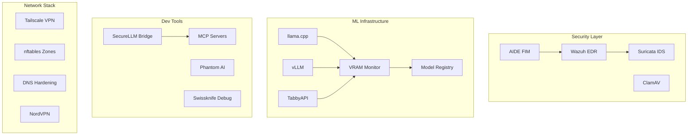

# NixOS Configuration

A modular, hardened NixOS configuration covering ML infrastructure, defense-in-depth security, custom package management, and automated CI/CD.

[](https://nixos.org)
[](https://github.com/VoidNxSEC/nixos/actions/workflows/ci.yml)
[](https://gitlab.com/VoidNxSEC/nixos)
[](https://app.cachix.org)
[](#security-notice)
[](LICENSE)

---

## Overview

This repository contains the declarative configuration for a production NixOS workstation. It is structured as a Nix flake with 281 modules across 20 categories (48,439 lines of Nix). Notable features:

- **ML Infrastructure** — GPU orchestration with llama.cpp, vLLM, and TabbyAPI backends.
- **Defense-in-Depth Security** — Kernel hardening, AIDE, ClamAV, AppArmor, and a full SOC stack (Wazuh, OpenSearch, Suricata).
- **Custom Package System** — Sandboxed package builders with Firejail/Bubblewrap isolation and audit trails.
- **Developer Tooling** — SecureLLM Bridge, MCP servers, AI-assisted CLI utilities.
- **Observability** — Prometheus, Grafana, Vector, and structured logging across the stack.

---

## System Inventory

A snapshot of the framework's scale, derived directly from the tracked sources:

| Metric                                | Value            |
| ------------------------------------- | ---------------- |
| Nix modules                           | 281              |
| Module categories                     | 20               |
| Lines of Nix (modules / repo-wide)    | 48,439 / 74,645  |
| Configurable options (`mkOption`)     | 1,020            |
| Feature toggles (`mkEnableOption`)    | 230              |
| `kernelcore.*` option modules         | 97               |
| systemd services defined              | 95               |
| systemd timers                        | 15               |
| Development shells                    | 6                |
| Utility scripts                       | 165              |
| Package overlays                      | 5                |
| Documentation files                   | 237              |

Configuration surface is namespaced under `kernelcore.*`, with the densest option trees in
`security` (66), `services` (60), `ssh` (42), `secrets` (36), `virtualization` (34),
`network` / `development` (33 each), and `soc` (29).

---

## Architecture


```mermaid
graph TB
    subgraph "Security Layer"
        AIDE[AIDE FIM]
        ClamAV[ClamAV]
        Wazuh[Wazuh EDR]
        Suricata[Suricata IDS]
    end

    subgraph "ML Infrastructure"
        LlamaCPP[llama.cpp]
        vLLM[vLLM]
        TabbyAPI[TabbyAPI]
        VRAM[VRAM Monitor]
        Registry[Model Registry]
    end

    subgraph "Dev Tools"
        SecureLLM[SecureLLM Bridge]
        MCP[MCP Servers]
        Phantom[Phantom AI]
        Swissknife[Swissknife Debug]
    end

    subgraph "Network Stack"
        Tailscale[Tailscale VPN]
        Firewall[nftables Zones]
        DNS[DNS Hardening]
        NordVPN[NordVPN]
    end

    LlamaCPP --> VRAM
    vLLM --> VRAM
    TabbyAPI --> VRAM
    VRAM --> Registry
    SecureLLM --> MCP
    Wazuh --> Suricata
    AIDE --> Wazuh
```

### Module Distribution

The configuration spans **281 modules across 20 categories**, totaling **48,439 lines of Nix** (74,645 LOC repository-wide). Categories ordered by footprint:

| Category         | Modules |    LOC | Focus                                          |
| ---------------- | ------: | -----: | ---------------------------------------------- |
| `shell`          |      40 |  7,063 | Aliases, rebuild system, service control       |
| `security`       |      39 |  5,842 | Hardening, AIDE, ClamAV, Wazuh/Suricata (SOC)  |
| `ml`             |      36 |  4,710 | llama.cpp, vLLM, TabbyAPI, model registry      |
| `desktop`        |      12 |  4,101 | Hyprland, i3, Waybar, theming                  |
| `services`       |      15 |  3,767 | GPU orchestration, MCP servers                 |
| `network`        |      16 |  3,493 | Tailscale, VPN, DNS, firewall zones            |
| `hardware`       |      12 |  2,701 | Laptop defense, NVIDIA tuning, thermal         |
| `applications`   |      14 |  2,599 | Hardened browsers, Electron tuning             |
| `containers`     |      10 |  2,363 | Docker, Podman, k3s, NixOS containers          |
| `packages`       |      21 |  2,185 | Sandboxed package builders                     |
| `virtualization` |       4 |  1,971 | vmctl, QEMU/libvirt                            |
| `system`         |      11 |  1,374 | Core system (nix, memory, I/O, binary cache)   |
| `development`    |       7 |  1,300 | Dev environments, CI/CD, git forges, Jupyter   |
| `tools`          |      10 |  1,244 | Unified CLI suite (nix-utils, diagnostics)     |
| `secrets`        |      16 |  1,181 | SOPS/age secret wiring                         |
| `audio`          |       3 |  1,027 | Production audio stack                         |
| `blockchain`     |       4 |    754 | Algorand node/DAO, chainscope                  |
| `debug`          |       5 |    368 | Swissknife diagnostics                         |
| `programs`       |       4 |    300 | phantom, vmctl, cognitive-vault                |
| `devops`         |       2 |     96 | GitLab CLI tooling                             |
| **Total**        | **281** | **48,439** |                                            |

---

## Key Subsystems

### ML Infrastructure

GPU-accelerated LLM stack integrated as NixOS modules:

```nix
kernelcore.ml.offload.enable = true;
```

- Backends: llama.cpp (turbo + swap variants), vLLM, TabbyAPI.
- SQLite model registry with auto-discovery.
- Rust-based REST control API on port 9000.
- Real-time VRAM monitoring with automatic offloading under pressure.
- MCP protocol integration for IDE clients.

### Security & SOC

Defense-in-depth with a complete SOC stack:

```nix
kernelcore.soc.enable = true;
kernelcore.security.hardening.enable = true;
```

- **File integrity & AV**: AIDE, ClamAV with scheduled scans.
- **Endpoint & network**: Wazuh EDR, Suricata IDS/IPS, AppArmor.
- **Hardening**: kernel sysctl/boot params, compiler hardening (PIE/RELRO/SSP), SSH hardening with key-only auth.
- **SIEM/Logs**: OpenSearch, Grafana, Vector, threat-intel feeds.

### Custom Package Management

Sandboxed package builders with audit logging:

- `.deb` packages under Firejail isolation.
- `tar.gz` extraction with FHS environments.
- npm packages with sandbox profiles.
- Automatic hash verification and GitHub release tracking.
- Examples: AppFlowy, Gemini CLI, Proton Suite, Cursor.

### Developer Tools

```nix
services.securellm-mcp.enable = true;
kernelcore.tools.enable = true;
kernelcore.swissknife.enable = true;
```

- **SecureLLM Bridge** — Multi-provider LLM orchestration (OpenAI, Anthropic, Bedrock, local) with rate limiting and fallback.
- **Tools CLI** — `nix-utils`, `secops`, `diagnostics`, `llm`, `mcp`.
- **Swissknife** — Thermal forensics, VRAM monitoring, emergency abort, build reproducibility analysis.

Dev shells:

```bash
nix develop            # base shell (default)
nix develop .#python   # Python with ML libs
nix develop .#cuda     # CUDA toolchain
nix develop .#rust     # Rust toolchain
nix develop .#node     # Node.js toolchain
nix develop .#infra    # Infrastructure tools
```

### Network Security

- Tailscale mesh VPN (zero-config peer-to-peer).
- NordVPN with kill-switch and post-quantum encryption.
- nftables-based firewall zones.
- DNSCrypt + DNS-over-TLS with caching.
- NGINX reverse proxy for Tailscale-exposed services.

### Desktop

- **Hyprland** (Wayland): custom v0.52.2 overlay, Waybar, Wofi, Wlogout.
- **i3** (X11): Polybar, Rofi, Picom.

---

## Notable Implementations

**Thermal Forensics** (760 lines)

```bash
thermal-forensics --duration 180
laptop-verdict /var/lib/thermal-evidence
```

3-phase stress test collecting baseline/stress/rebuild thermal data for hardware warranty claims.

**Advanced Rebuild** (674 lines)

```bash
rebuild-advanced --profile workstation --check-thermal
```

Pre-flight checks, thermal monitoring, and binary cache integration during rebuilds.

**GPU Orchestration** (252 lines)
Unloads llama.cpp models when VRAM drops below 2GB; maintains service priority queues.

**SOC Stack**
Full Wazuh + OpenSearch + Suricata deployment running on a workstation-class machine.

---

## Repository Structure

```
/etc/nixos/
├── flake.nix                # Flake entry point
├── modules/                 # 281 modules / 20 categories
│   ├── shell/               # Shell configuration (40)
│   ├── security/            # Security + SOC (39)
│   ├── ml/                  # ML infrastructure (36)
│   ├── packages/            # Custom packages (21)
│   ├── network/             # Networking (16)
│   ├── secrets/             # SOPS secret wiring (16)
│   ├── services/            # System services (15)
│   ├── applications/        # Hardened browsers, Electron tuning (14)
│   ├── desktop/             # Hyprland, i3, Waybar, theming (12)
│   ├── hardware/            # Laptop defense, NVIDIA, thermal (12)
│   ├── system/              # Core system configuration (11)
│   ├── containers/          # Docker, Podman, k3s (10)
│   ├── tools/               # Unified CLI suite (10)
│   ├── development/         # Dev environments, CI/CD (7)
│   ├── debug/               # Swissknife diagnostics (5)
│   ├── blockchain/          # Algorand node/DAO, chainscope (4)
│   ├── programs/            # phantom, vmctl, cognitive-vault (4)
│   ├── virtualization/      # vmctl, QEMU/libvirt (4)
│   ├── audio/               # Production audio stack (3)
│   └── devops/              # GitLab CLI tooling (2)
├── hosts/kernelcore/        # Host configuration
├── overlays/                # Package overlays
├── lib/                     # Reusable functions
├── secrets/                 # SOPS-encrypted secrets
└── docs/                    # Documentation
```

---

## Quick Start

### Prerequisites

- NixOS 23.11+ or nixos-unstable
- NVIDIA GPU (optional, for ML features)
- Git

### Installation

```bash
git clone https://github.com/VoidNxSEC/nixos.git /etc/nixos
cd /etc/nixos

# Review host configuration
cat hosts/kernelcore/configuration.nix

# Dry-run build
sudo nixos-rebuild build --flake .#kernelcore

# Apply
sudo nixos-rebuild switch --flake .#kernelcore
```

### Feature Flags

```nix
{
  kernelcore.ml.offload.enable = true;          # ML infrastructure
  kernelcore.soc.enable = true;                 # SOC/SIEM stack
  kernelcore.security.hardening.enable = true;  # Kernel/compiler hardening
  services.securellm-mcp.enable = true;         # SecureLLM Bridge
  kernelcore.tools.enable = true;               # Unified CLI suite
  kernelcore.swissknife.enable = true;          # Debug toolkit
}
```

---

## CI/CD

CI runs on GitHub Actions (primary) with a GitLab CI mirror. The main `ci.yml` workflow runs `nix flake check` and builds the `kernelcore` closure on every push; additional workflows handle observability/debug (tmate), deployment, rollback, SOPS secret setup, and weekly `flake.lock` updates.

A Cachix binary cache (`marcosfpina`) is populated by CI so local rebuilds pull pre-built closures when available.

For the full workflow catalog, composite actions, required secrets, and reusable-workflow examples, see [.github/CI-CD.md](.github/CI-CD.md). The GitLab pipeline is defined in [`.gitlab-ci.yml`](./.gitlab-ci.yml).

---

## Documentation

- [Technical Overview](docs/TECHNICAL-OVERVIEW.md)
- [CI/CD Architecture](docs/CI-CD-ARCHITECTURE.md)
- [GitHub Actions reference](.github/CI-CD.md) — composite actions, workflow catalog, secrets
- [Workflow debugging guide](.github/workflows/WORKFLOWS.md) — tmate, observability, notifications

---

## Security Notice

- **Environment**: production workstation.
- **Posture**: hardened (kernel, compiler, network, filesystem).
- **Secrets**: encrypted with SOPS + age.
- **Audit**: AIDE + auditd + Wazuh logging across system surfaces.

Sensitive material (API keys, SSH keys, certificates) lives encrypted in `secrets/`. Decryption requires the appropriate age key.

---

## Stats

- **Modules**: 281 across 20 categories
- **Nix lines**: 48,439 (modules) / 74,645 (repository-wide)
- **Shell modules**: 40
- **Security + SOC modules**: 39
- **ML modules**: 36
- **Custom packages**: 21

Largest modules:

1. `virtualization/vmctl` — 959 lines (VM orchestration CLI)
2. `desktop/hyprland-modular` — 852 lines (Wayland desktop)
3. `hardware/laptop-defense` — 760 lines (thermal forensics / evidence collection)
4. `ml/services/llama-cpp-swap` — 682 lines (model swap backend)
5. `shell/aliases/nix/rebuild-advanced` — 674 lines (safe rebuild system)

---

## License

[MIT](LICENSE)

---

## Acknowledgments

Built on:

- [NixOS](https://nixos.org) — declarative Linux distribution
- [Hyprland](https://hyprland.org) — Wayland compositor
- [Wazuh](https://wazuh.com) — XDR/SIEM platform
- [llama.cpp](https://github.com/ggerganov/llama.cpp) — LLM inference engine

---

**Maintained by**: [@VoidNxSEC](https://github.com/VoidNxSEC)
**Hardware**: Acer laptop (Lenovo-compatible tuning profiles) + NVIDIA GPU
**Channel**: nixos-unstable
**Status**: production (daily driver)
