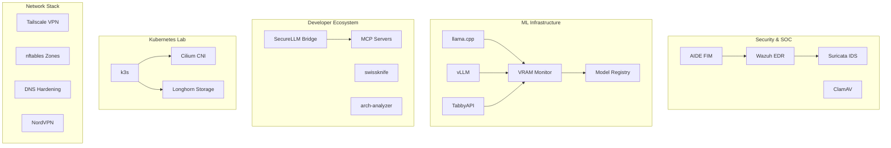

# NixOS Configuration

[](https://nixos.org)
[](https://github.com/VoidNxSEC/nixos/actions/workflows/ci.yml)
[](https://app.cachix.org)
[](#security-notice)
[](LICENSE)

A platform-agnostic NixOS orchestrator. One declarative flake drives three system targets — the `kernelcore` workstation, a minimal installer ISO, and a Kubernetes `k8s-node` — from 281 modules across 20 categories (48,439 lines of Nix). The same module set is exported as `nixosModules.default` with a `minimal` template, so a fresh machine can import the whole framework and switch into a known state.

The repository doubles as the integration point for roughly ten first-party flakes — SecureLLM MCP and Bridge, swissknife, spider-nix, arch-analyzer, cognitive-vault, spooknix, actions-tv, ai-agent-os, i915-governor. A full personal toolchain becomes part of the system, declarative and reproducible on every rebuild.

---

## Contents

- [Overview](#overview)
- [Architecture](#architecture)
- [Repository Structure](#repository-structure)
- [Inventory & Modules](#inventory--modules)
- [Subsystems](#subsystems)
- [Notable Implementations](#notable-implementations)
- [Quick Start](#quick-start)
- [CI/CD](#cicd)
- [Documentation](#documentation)
- [Security Notice](#security-notice)
- [License](#license)

---

## Overview

Three system targets grow from one source tree:

- **`kernelcore`** — the daily-driver workstation: ML serving, a self-hosted SOC, a hardened kernel, and Hyprland/Niri/i3 desktops.
- **`kernelcore-iso`** — a minimal installer image assembled from the same host modules.
- **`k8s-node`** — a Kubernetes node profile (k3s + Cilium + Longhorn) sharing the base system.

Core capabilities:

- **ML infrastructure** — llama.cpp, vLLM, and TabbyAPI behind a VRAM-aware offload controller and a SQLite model registry.
- **Defense-in-depth security** — kernel and compiler hardening feeding a complete SOC: Wazuh, OpenSearch, Suricata, AIDE, ClamAV, AppArmor.
- **Sandboxed package system** — `.deb`, `tar.gz`, and npm builders isolated under Firejail/Bubblewrap, with hash verification and audit trails.
- **Developer ecosystem** — SecureLLM Bridge, MCP servers, swissknife diagnostics, and a unified CLI suite, each delivered by its own flake.
- **Observability** — Prometheus, Grafana, Vector, and structured logging across the stack.

---

## Architecture


```mermaid
graph TB
    subgraph "Security & SOC"
        AIDE[AIDE FIM]
        ClamAV[ClamAV]
        Wazuh[Wazuh EDR]
        Suricata[Suricata IDS]
    end

    subgraph "ML Infrastructure"
        LlamaCPP[llama.cpp]
        vLLM[vLLM]
        TabbyAPI[TabbyAPI]
        VRAM[VRAM Monitor]
        Registry[Model Registry]
    end

    subgraph "Developer Ecosystem"
        SecureLLM[SecureLLM Bridge]
        MCP[MCP Servers]
        Swissknife[swissknife]
        ArchAnalyzer[arch-analyzer]
    end

    subgraph "Kubernetes Lab"
        K3s[k3s]
        Cilium[Cilium CNI]
        Longhorn[Longhorn Storage]
    end

    subgraph "Network Stack"
        Tailscale[Tailscale VPN]
        Firewall[nftables Zones]
        DNS[DNS Hardening]
        NordVPN[NordVPN]
    end

    LlamaCPP --> VRAM
    vLLM --> VRAM
    TabbyAPI --> VRAM
    VRAM --> Registry
    SecureLLM --> MCP
    Wazuh --> Suricata
    AIDE --> Wazuh
    K3s --> Cilium
    K3s --> Longhorn
```

### Module Distribution

| Category       | Modules | Notes                                     |
| -------------- | ------- | ----------------------------------------- |
| Security + SOC | 39      | AIDE, ClamAV, Wazuh, Suricata, hardening  |
| ML             | 36      | llama.cpp, vLLM, TabbyAPI, model registry |
| Packages       | 36      | Sandboxed package builders                |
| Shell          | 35      | Aliases, rebuild system, utilities        |
| Services       | 16      | GPU orchestration, MCP servers            |
| Network        | 12      | Tailscale, VPN, DNS, firewall zones       |
| Hardware       | 12      | Thermal forensics, NVIDIA tuning          |

**Totals**: 20 categories, 278 modules, ~48k lines of Nix.

---

## Key Subsystems

### ML Infrastructure

GPU-accelerated LLM stack integrated as NixOS modules:

```nix
kernelcore.ml.offload.enable = true;
```

- Backends: llama.cpp (turbo + swap variants), vLLM, TabbyAPI.
- SQLite model registry with auto-discovery.
- Rust-based REST control API on port 9000.
- Real-time VRAM monitoring with automatic offloading under pressure.
- MCP protocol integration for IDE clients.

### Security & SOC

Defense-in-depth with a complete SOC stack:

```nix
kernelcore.soc.enable = true;
kernelcore.security.hardening.enable = true;
```

- **File integrity & AV**: AIDE, ClamAV with scheduled scans.
- **Endpoint & network**: Wazuh EDR, Suricata IDS/IPS, AppArmor.
- **Hardening**: kernel sysctl/boot params, compiler hardening (PIE/RELRO/SSP), SSH hardening with key-only auth.
- **SIEM/Logs**: OpenSearch, Grafana, Vector, threat-intel feeds.

### Custom Package Management

Sandboxed package builders with audit logging:

- `.deb` packages under Firejail isolation.
- `tar.gz` extraction with FHS environments.
- npm packages with sandbox profiles.
- Automatic hash verification and GitHub release tracking.
- Examples: AppFlowy, Gemini CLI, Proton Suite, Cursor.

### Developer Tools

```nix
services.securellm-mcp.enable = true;
kernelcore.tools.enable = true;
kernelcore.swissknife.enable = true;
```

- **SecureLLM Bridge** — Multi-provider LLM orchestration (OpenAI, Anthropic, Bedrock, local) with rate limiting and fallback.
- **Tools CLI** — `nix-utils`, `secops`, `diagnostics`, `llm`, `mcp`.
- **Swissknife** — Thermal forensics, VRAM monitoring, emergency abort, build reproducibility analysis.

Dev shells:

```bash
nix develop .#python    # Python with ML libs
nix develop .#cuda      # CUDA toolchain
nix develop .#rust      # Rust toolchain
nix develop .#infra     # Infrastructure tools
```

### Network Security

- Tailscale mesh VPN (zero-config peer-to-peer).
- NordVPN with kill-switch and post-quantum encryption.
- nftables-based firewall zones.
- DNSCrypt + DNS-over-TLS with caching.
- NGINX reverse proxy for Tailscale-exposed services.

### Desktop

- **Hyprland** (Wayland): custom v0.52.2 overlay, Waybar, Wofi, Wlogout.
- **i3** (X11): Polybar, Rofi, Picom.

---

## Notable Implementations

**Thermal Forensics** (760 lines)

```bash
thermal-forensics --duration 180
laptop-verdict /var/lib/thermal-evidence
```

3-phase stress test collecting baseline/stress/rebuild thermal data for hardware warranty claims.

**Advanced Rebuild** (674 lines)

```bash
rebuild-advanced --profile workstation --check-thermal
```

Pre-flight checks, thermal monitoring, and binary cache integration during rebuilds.

**GPU Orchestration** (252 lines)
Unloads llama.cpp models when VRAM drops below 2GB; maintains service priority queues.

**SOC Stack**
Full Wazuh + OpenSearch + Suricata deployment running on a workstation-class machine.

---

## Repository Structure

```
/etc/nixos/
├── flake.nix                # Three targets, ~10 first-party inputs, exports
├── modules/                 # 281 modules / 20 categories
│   ├── shell/               # Shell configuration (40)
│   ├── security/            # Security + SOC (39)
│   ├── ml/                  # ML infrastructure (36)
│   ├── packages/            # Custom packages (21)
│   ├── network/             # Networking (16)
│   ├── secrets/             # SOPS secret wiring (16)
│   ├── services/            # System services (15)
│   ├── applications/        # Hardened browsers, Electron tuning (14)
│   ├── desktop/             # Hyprland, Niri, i3, theming (12)
│   ├── hardware/            # Laptop defense, NVIDIA, thermal (12)
│   ├── system/              # Core system configuration (11)
│   ├── containers/          # Docker, Podman, k3s (10)
│   ├── tools/               # Unified CLI suite (10)
│   ├── development/         # Dev environments, CI/CD (7)
│   ├── debug/               # swissknife diagnostics (5)
│   ├── blockchain/          # Algorand node/DAO, chainscope (4)
│   ├── programs/            # phantom, vmctl, cognitive-vault (4)
│   ├── virtualization/      # vmctl, QEMU/libvirt (4)
│   ├── audio/               # Production audio stack (3)
│   └── devops/              # GitLab CLI tooling (2)
├── hosts/                   # Per-target host configuration
├── profiles/                # k8s-lab and other system profiles
├── overlays/                # Package overlays
├── lib/                     # Dev shells, package builders, helpers
├── secrets/                 # SOPS-encrypted secrets
├── templates/               # Importable starting points (minimal)
└── docs/                    # Documentation
```

---

## Inventory & Modules

Figures read straight from the tracked sources:

| Metric                             | Value           |
| ---------------------------------- | --------------- |
| Nix modules                        | 281             |
| Module categories                  | 20              |
| Lines of Nix (modules / repo-wide) | 48,439 / 74,645 |
| Configurable options (`mkOption`)  | 1,020           |
| Feature toggles (`mkEnableOption`) | 230             |
| systemd services / timers          | 95 / 15         |
| Development shells                 | 6               |
| Utility scripts                    | 165             |
| Package overlays                   | 5               |
| First-party flake inputs           | ~10             |

Every option sits under the `kernelcore.*` namespace, densest in `security` (66), `services` (60), `ssh` (42), `secrets` (36), `virtualization` (34), `network` and `development` (33 each), and `soc` (29).

Module footprint by category, ordered by lines of Nix:

| Category         | Modules |        LOC | Focus                                         |
| ---------------- | ------: | ---------: | --------------------------------------------- |
| `shell`          |      40 |      7,063 | Aliases, rebuild system, service control      |
| `security`       |      39 |      5,842 | Hardening, AIDE, ClamAV, Wazuh/Suricata (SOC) |
| `ml`             |      36 |      4,710 | llama.cpp, vLLM, TabbyAPI, model registry     |
| `desktop`        |      12 |      4,101 | Hyprland, Niri, i3, theming                   |
| `services`       |      15 |      3,767 | GPU orchestration, MCP servers                |
| `network`        |      16 |      3,493 | Tailscale, VPN, DNS, firewall zones           |
| `hardware`       |      12 |      2,701 | Laptop defense, NVIDIA tuning, thermal        |
| `applications`   |      14 |      2,599 | Hardened browsers, Electron tuning            |
| `containers`     |      10 |      2,363 | Docker, Podman, k3s, NixOS containers         |
| `packages`       |      21 |      2,185 | Sandboxed package builders                    |
| `virtualization` |       4 |      1,971 | vmctl, QEMU/libvirt                           |
| `system`         |      11 |      1,374 | Core system (nix, memory, I/O, binary cache)  |
| `development`    |       7 |      1,300 | Dev environments, CI/CD, git forges, Jupyter  |
| `tools`          |      10 |      1,244 | Unified CLI suite (nix-utils, diagnostics)    |
| `secrets`        |      16 |      1,181 | SOPS/age secret wiring                        |
| `audio`          |       3 |      1,027 | Production audio stack                        |
| `blockchain`     |       4 |        754 | Algorand node/DAO, chainscope                 |
| `debug`          |       5 |        368 | swissknife diagnostics                        |
| `programs`       |       4 |        300 | phantom, vmctl, cognitive-vault               |
| `devops`         |       2 |         96 | GitLab CLI tooling                            |
| **Total**        | **281** | **48,439** |                                               |

---

## Subsystems

### ML Infrastructure

GPU-resident LLM serving managed as NixOS modules with VRAM-aware offload.

```nix
kernelcore.ml.offload.enable = true;
```

- Backends: llama.cpp (turbo and swap variants), vLLM, TabbyAPI.
- SQLite model registry with auto-discovery; Rust control API on port 9000.
- VRAM monitor unloads idle models under pressure and keeps a service priority queue.
- MCP protocol bridges the stack to IDE clients.

### Security & SOC

Hardening from boot to userspace, feeding a self-hosted SOC.

```nix
kernelcore.soc.enable = true;
kernelcore.security.hardening.enable = true;
```

- Integrity and AV: AIDE file-integrity monitoring, ClamAV scheduled scans.
- Endpoint and network: Wazuh EDR, Suricata IDS/IPS, AppArmor profiles.
- Hardening: kernel sysctl/boot parameters, compiler flags (PIE/RELRO/SSP), key-only SSH.
- SIEM: OpenSearch, Grafana dashboards, Vector pipelines, threat-intel feeds.
- Override order: `modules/security/*` settle first, `sec/hardening.nix` applies the final `mkForce` layer, and `profiles/k8s-lab.nix` relaxes network rules for local clusters.

### Kubernetes Lab

A single-node cluster wired into the workstation for local orchestration work.

```nix
# k3s + Cilium + Longhorn, imported via profiles/k8s-lab.nix
# worker nodes provision from the .#k8s-node target
```

- k3s control plane with Cilium CNI and Longhorn distributed storage.
- `profiles/k8s-lab.nix` opens the API server, etcd, and CNI ports and loosens ICMP/firewall rules for lab use.
- The `k8s-node` nixosConfiguration builds worker nodes from the same source tree.

### Custom Package Management

Third-party software repackaged under sandbox profiles with audit logging.

- `.deb` packages run under Firejail isolation.
- `tar.gz` archives unpack into FHS environments.
- npm packages build with per-package sandbox profiles.
- Hash verification and GitHub release tracking on every fetch.
- Shipping examples: AppFlowy, Gemini CLI, Proton Suite, Cursor.

### Developer Ecosystem

First-party flakes plug a personal toolchain straight into the system.

```nix
services.securellm-mcp.enable = true;
kernelcore.tools.enable = true;
kernelcore.swissknife.enable = true;
```

- **SecureLLM Bridge** — multi-provider LLM orchestration (OpenAI, Anthropic, Bedrock, local) with rate limiting and fallback.
- **Tools CLI** — `nix-utils`, `secops`, `diagnostics`, `llm`, `mcp`.
- **swissknife** — thermal forensics, VRAM monitoring, emergency abort, build-reproducibility analysis.
- **arch-analyzer, cognitive-vault, ai-agent-os, spider-nix** — architecture analysis, knowledge storage, OS-level monitoring, and proxy tooling, each its own flake.

Dev shells:

```bash
nix develop            # base shell (default)
nix develop .#python   # Python with ML libs
nix develop .#cuda     # CUDA toolchain
nix develop .#rust     # Rust toolchain
nix develop .#node     # Node.js toolchain
nix develop .#infra    # Infrastructure tools
```

### Network Security

Mesh connectivity behind zoned firewalling.

- Tailscale peer-to-peer mesh VPN.
- NordVPN over NordLynx (WireGuard) with a kill-switch.
- nftables firewall zones.
- DNSCrypt and DNS-over-TLS with local caching.
- NGINX reverse proxy for Tailscale-exposed services.

### Desktop

Three compositors, selectable per session.

- **Hyprland** (Wayland) — custom overlay, Waybar, Wofi, Wlogout.
- **Niri** (Wayland) — scrollable-tiling layout via niri-flake.
- **i3** (X11) — Polybar, Rofi, Picom.

### Mobile Workspace

An SSH-first workspace for driving the machine from a phone.

```nix
services.mobile-workspace.enable = true;
```

- Mosh plus a dedicated `mobile` user with git access over SSH.
- Keyed for an iPhone client, workspace rooted at `/srv/mobile-workspace`.

---

## Notable Implementations

The heaviest single modules, and what they carry:

1. **`virtualization/vmctl`** (959 lines) — VM orchestration CLI over QEMU/libvirt.
2. **`desktop/hyprland-modular`** (852 lines) — modular Hyprland desktop: rules, binds, theming.
3. **`hardware/laptop-defense`** (760 lines) — thermal forensics and hardware-evidence suite.
4. **`ml/services/llama-cpp-swap`** (682 lines) — hot-swap backend for llama.cpp models.
5. **`shell/aliases/nix/rebuild-advanced`** (674 lines) — guarded rebuild system.

**Thermal forensics**

```bash
thermal-forensics --duration 180
laptop-verdict /var/lib/thermal-evidence
```

A three-phase stress run (baseline, load, rebuild) that gathers thermal evidence for hardware warranty claims.

**Advanced rebuild**

```bash
rebuild-advanced --profile workstation --check-thermal
```

Pre-flight checks, thermal monitoring, and binary-cache integration wrapped around `nixos-rebuild`.

**GPU orchestration**

Unloads llama.cpp models once free VRAM crosses the low-water mark and holds a service priority queue.

---

## Quick Start

### Prerequisites

- nixos-unstable with flakes enabled
- NVIDIA GPU for the ML stack (optional)
- Git

### Build a target

```bash
git clone https://github.com/VoidNxSEC/nixos.git /etc/nixos
cd /etc/nixos

sudo nixos-rebuild build  --flake .#kernelcore   # dry-run
sudo nixos-rebuild switch --flake .#kernelcore   # apply
```

Other targets: `.#kernelcore-iso` builds the installer image, `.#k8s-node` a Kubernetes worker.

### Import as a framework

```nix
# in another flake
inputs.kernelcore.url = "github:VoidNxSEC/nixos";

# inside nixpkgs.lib.nixosSystem { modules = [ ... ]; }
modules = [ inputs.kernelcore.nixosModules.default ];
```

Or start from the bundled template:

```bash
nix flake init -t github:VoidNxSEC/nixos#minimal
```

### Feature flags

```nix
{
  kernelcore.ml.offload.enable = true;          # ML infrastructure
  kernelcore.soc.enable = true;                 # SOC/SIEM stack
  kernelcore.security.hardening.enable = true;  # kernel/compiler hardening
  services.securellm-mcp.enable = true;         # SecureLLM Bridge
  kernelcore.tools.enable = true;               # unified CLI suite
  kernelcore.swissknife.enable = true;          # debug toolkit
}
```

---

## CI/CD

GitHub Actions is primary, with a GitLab CI mirror. The main `ci.yml` workflow runs `nix flake check` and builds the `kernelcore` closure on every push; companion workflows cover observability/debug (tmate), deployment, rollback, SOPS secret setup, and weekly `flake.lock` updates.

A Cachix binary cache (`marcosfpina`) is populated by CI, so local rebuilds pull pre-built closures when they exist.

The full workflow catalog, composite actions, required secrets, and reusable-workflow examples live in [.github/CI-CD.md](.github/CI-CD.md). The GitLab pipeline is defined in [`.gitlab-ci.yml`](./.gitlab-ci.yml).

---

## Documentation

- [Technical Overview](docs/TECHNICAL-OVERVIEW.md)
- [CI/CD Architecture](docs/CI-CD-ARCHITECTURE.md)
- [GitHub Actions reference](.github/CI-CD.md) — composite actions, workflow catalog, secrets
- [Workflow debugging guide](.github/workflows/WORKFLOWS.md) — tmate, observability, notifications

---

## Security Notice

- **Environment**: production workstation.
- **Posture**: hardened across kernel, compiler, network, and filesystem.
- **Secrets**: encrypted with SOPS + age, bound to the host SSH key.
- **Audit**: AIDE, auditd, and Wazuh logging across system surfaces.

Sensitive material — API keys, SSH keys, certificates — stays encrypted in `secrets/`. Decryption needs the matching age key.

---

## License

[MIT](LICENSE)

---

## Acknowledgments

Built on:

- [NixOS](https://nixos.org) — declarative Linux distribution
- [Hyprland](https://hyprland.org) and [Niri](https://github.com/YaLTeR/niri) — Wayland compositors
- [Wazuh](https://wazuh.com) — XDR/SIEM platform
- [llama.cpp](https://github.com/ggerganov/llama.cpp) — LLM inference engine

---
